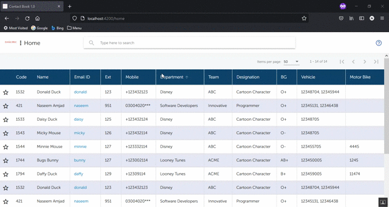

# ContactBook V1.0

## About

This project was generated with [Angular CLI](https://github.com/angular/angular-cli) version 6.0.8.
The ContactBook uses RestApi to fetch data from DB (SQLite in current case). It is a demonstration of Quick/Instant Search/Filter of data using Angular. Can be beneficial for organizations that want to have a place to find employees based on their name , designation , contact number etc.

Online Demo can be seen at https://www.ajsoftpk.com/demo/contact-book/home

## Technical Detail
To change WebService URL, goto `./Contactbookv1.0/src/employee/employee.service.ts -> apiUrl`

Dont forget to allow CORS in your custom API.
Recommended Pattern for URL ReWrite is (home|favs|links)$

### About Source Code

Entry point to angular = main.ts - Never going to need to change this

index.html = Top Level html

styles.css = Top Level css

- AppComponent
	- navbar
		- ToolbarSearchComponent
	- router-outer
		- HomeComponent

- ToolbarSearchComponent
	- Searchbar
	- Advanced search toggle

- HomeComponent
	- AdvancedSearchComponent
	- Paginator
	- Table

- AdvancedSearchComponent
	- Form for advanced search

- DataTransferService
	- Holds methods and fields for tranfer of data from Component to Component

- RedirectComponent
	- Redirects to last open page if navigated to empty path
	eg. If you close the browser on site/favs and open site/ later, it redirects to site/favs

- EmployeeService
	- Fetches data from local web service of all employees
	Some fallback records for contact (incase unable to connect with WebService)

## Development server

Run `ng serve` for a dev server. Navigate to `http://localhost:4200/`. The app will automatically reload if you change any of the source files.

## Build

Run `ng build` to build the project. The build artifacts will be stored in the `dist/` directory. Use the `--prod` flag for a production build.

## Further help

To get more help on the Angular CLI use `ng help`

## Author
You may contact me at naseem@technologist.com

